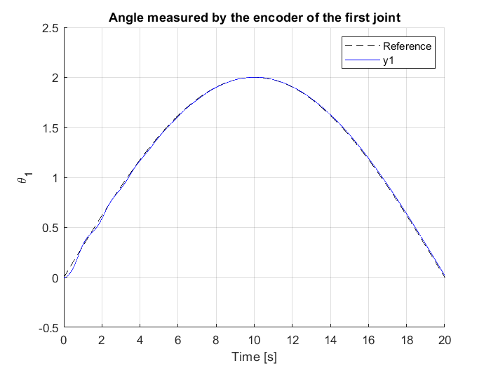
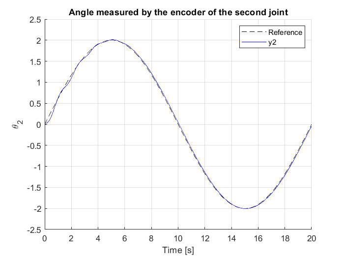
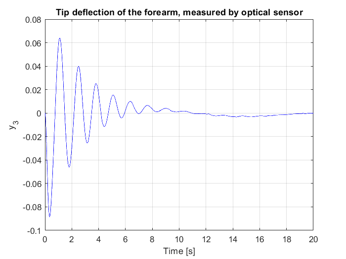

# Flexible-Forearm-Robot-Manipulator-Control

In this project has been implemented the dynamics of a two-link planar-arm robot with flexible second link. Then it has been designed a simple PD controller in order to follow a sinusoidal trajectory and stabilize the flexible joint oscillation. 

The robot model considered is described in the following paper: https://ieeexplore.ieee.org/document/9993103

# Results
Here are reported  the results. The first variable, namely the angle measured by the encoder placed on the motor moving the first joint, is able to track perfectly the path. The controller variables used to obtain the plot below are KP=50 and KD=3. The  trajectory is a sinusoudal function with amplitude and frequency are customizable as well as the controller. Check the code!

  

Same can be said for the second variable, that represents the encoder placed on the second motor. Here the controller variables where KP=15 and KD=1. Here is the plot!

  

Finally, it can be observed that the last output variable, which represents the tip deflection of the second link measured by an optical sensor, is drived to zero by the controller. This means that, after the transient, the second link deflection is really small. Here it can be observed clearly.

  

